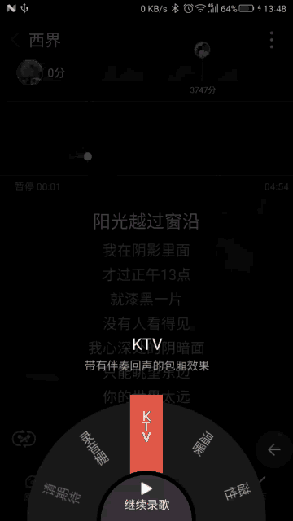
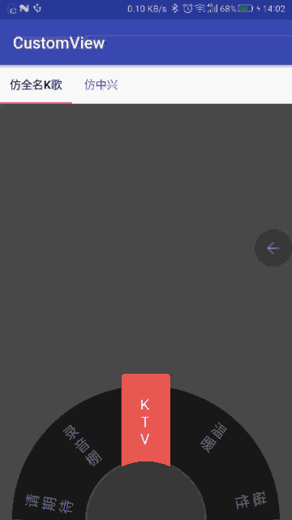
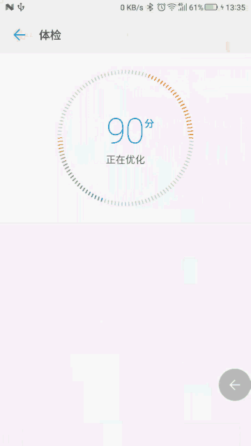
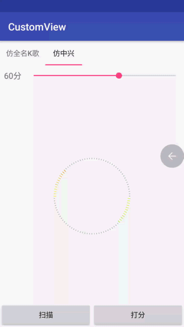

# CutsomViews
通过业余时间模仿其他APP中的自定义控件效果，欢迎start和issues！

## 目录
* [一、全名K歌转盘效果](##一、全名K歌转盘效果)
* [二、ZTE扫描打分效果](##二、ZTE扫描打分效果)

##一、全名K歌转盘效果

### 转盘参考自[https://github.com/BCsl/CursorWheelLayout](https://github.com/hongyangAndroid/AndroidAutoLayout)

##二、ZTE扫描打分效果

颜色是通过HSV与ARGB之间的互换计算的，渐变计算和原效果有点偏差,欢迎大家给出更好的计算方法！

